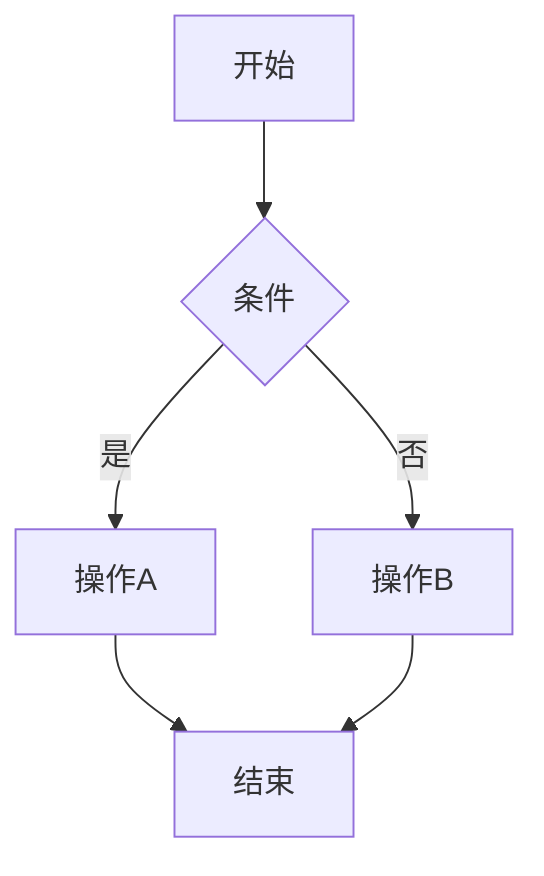

# Markdown 格式测试

## 标题

### 三级标题

#### 四级标题

---

## 段落

这是一段普通的文本段落，用于测试 Markdown 到 HTML 的转换效果。

**加粗文本** 和 *斜体文本* 的测试。

~~删除线文本~~ 的测试。

---

## 列表

### 无序列表
- 项目一
- 项目二
  - 子项目 A
  - 子项目 B
- 项目三

### 有序列表
1. 第一步
2. 第二步
3. 第三步

### 任务列表
- [x] 已完成任务
- [ ] 待完成任务
- [ ] 另一个待完成任务

---

## 代码

### 行内代码

这是 `print("Hello World")` 的行内代码示例。

### 代码块

```python
def hello():
    print("Hello World")
    return True
```

---

## 表格

| 姓名 | 年龄 | 职业 |
|------|------|------|
| 张三 | 28 | 工程师 |
| 李四 | 32 | 设计师 |

---

## 引用

> 这是一段引用文本。
> 
> 引用的第二行。

---

## 链接和图片

[访问 GitHub](https://github.com)

---

## Mermaid 图表



---

## 脚注

这是一个带有脚注的文本[^1]。

[^1]: 这是脚注的内容。
